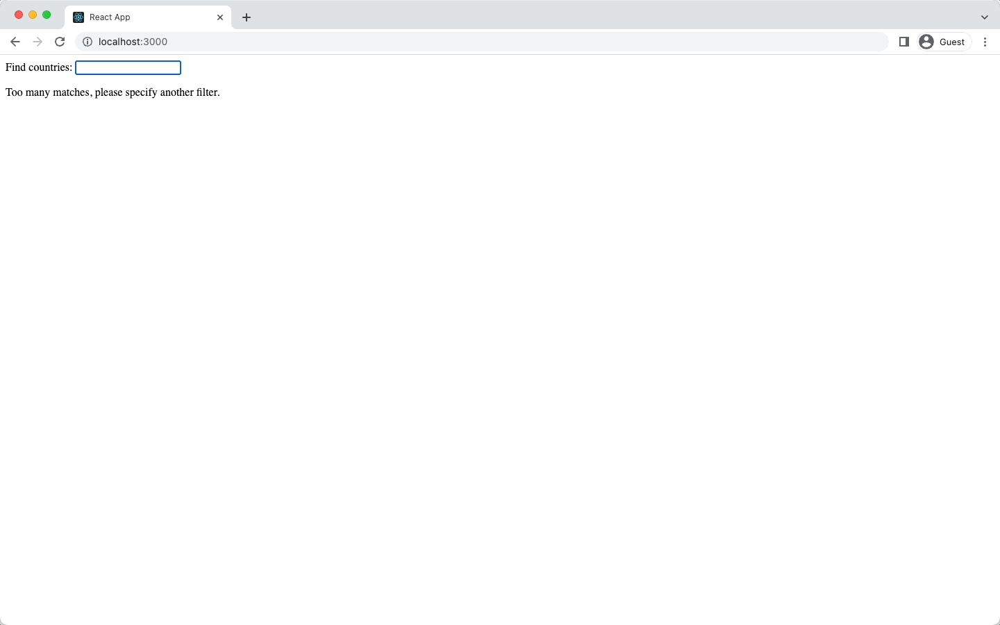

# Country Data Viewer

This simple React app shows basic information about a country and the current weather.
It uses the [REST Countries](https://restcountries.com/) and [OpenWeather](https://openweathermap.org/) APIs to fetch data.
This project is a part of University of Helsinki's [Full Stack Open](https://fullstackopen.com/en/).



## Setup

You'll need an [OpenWeather](https://openweathermap.org/) API key to run the app.
Create an account to grab one for free.
To save the API key as an environment variable, create a `.env` file in root of the project with the following content, replacing `t0p53cr3t4p1k3yv4lu3` with your own API key.

```
# .env
REACT_APP_API_KEY=t0p53cr3t4p1k3yv4lu3
```

Then, run `npm install` to install dependencies and `npm start` to start the app.

## Additional notes

Some countries (e.g., Sudan) is part of the name of another country (e.g., South Sudan), which creates a bug where you cannot view the data of these countries.
I did not optimize for this edge case.
